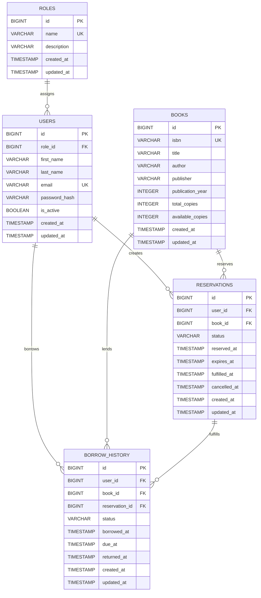

# java-projekt-Dudek-Galezowski
Aplikacja do obsługi biblioteki

## ERD bazy danych

```mermaid
erDiagram
    ROLES ||--o{ USERS : assigns
    USERS ||--o{ RESERVATIONS : creates
    BOOKS ||--o{ RESERVATIONS : reserves
    USERS ||--o{ BORROW_HISTORY : borrows
    BOOKS ||--o{ BORROW_HISTORY : lends
    RESERVATIONS ||--o{ BORROW_HISTORY : fulfills

    ROLES {
        BIGINT id PK
        VARCHAR name UK
        VARCHAR description
        TIMESTAMP created_at
        TIMESTAMP updated_at
    }

    USERS {
        BIGINT id PK
        BIGINT role_id FK
        VARCHAR first_name
        VARCHAR last_name
        VARCHAR email UK
        VARCHAR password_hash
        BOOLEAN is_active
        TIMESTAMP created_at
        TIMESTAMP updated_at
    }

    BOOKS {
        BIGINT id PK
        VARCHAR isbn UK
        VARCHAR title
        VARCHAR author
        VARCHAR publisher
        INTEGER publication_year
        INTEGER total_copies
        INTEGER available_copies
        TIMESTAMP created_at
        TIMESTAMP updated_at
    }

    RESERVATIONS {
        BIGINT id PK
        BIGINT user_id FK
        BIGINT book_id FK
        VARCHAR status
        TIMESTAMP reserved_at
        TIMESTAMP expires_at
        TIMESTAMP fulfilled_at
        TIMESTAMP cancelled_at
        TIMESTAMP created_at
        TIMESTAMP updated_at
    }

    BORROW_HISTORY {
        BIGINT id PK
        BIGINT user_id FK
        BIGINT book_id FK
        BIGINT reservation_id FK
        VARCHAR status
        TIMESTAMP borrowed_at
        TIMESTAMP due_at
        TIMESTAMP returned_at
        TIMESTAMP created_at
        TIMESTAMP updated_at
    }
```
